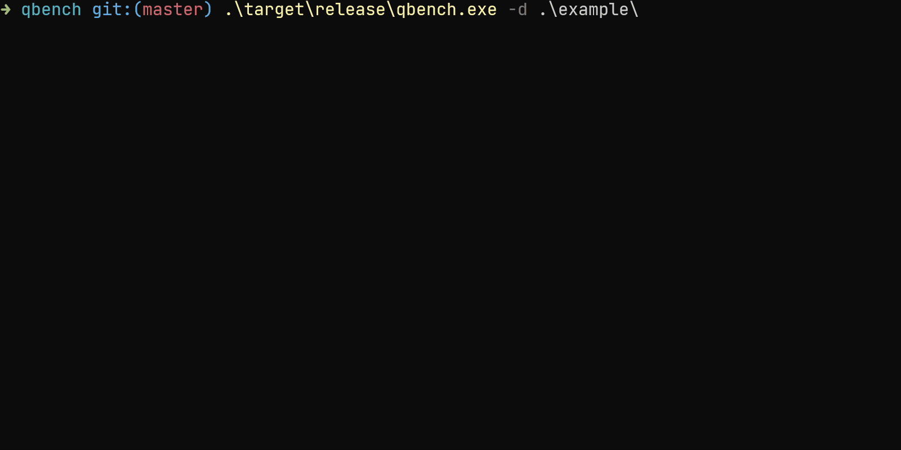

# QBench

[](https://opensource.org/licenses/MIT)
[](https://opensource.org/licenses/Apache-2.0)

A simple query benchmarking tool for SQL databases,
specifically designed for checking performance between
multiple revisions of same query.

## Usage

This below cargo command will show all available options for qbench.

```bash
cargo run -- -h
```

## Example

see [example/test.toml](example/test.toml) for a required toml bench configuration to compare some valid postgresql
queries.

Run this below command to benchmark the benchmark configurations in example folder.

```bash
cargo build && target\release\qbench -d example
```
## Output
### Benchmark Succeeded

### Benchmark Failed


